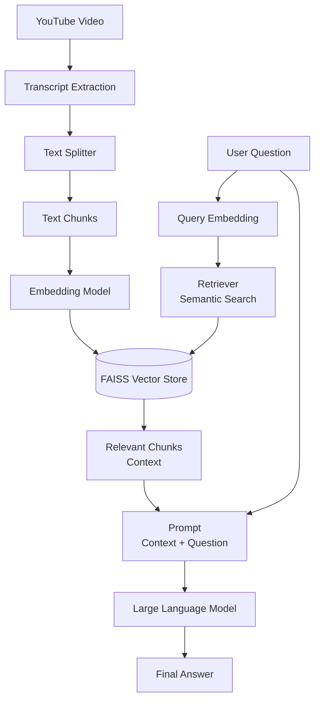

# 🎥 YouTube Chat System (RAG + Streamlit)

An AI-powered **YouTube Chat System** that allows users to **interactively chat with YouTube videos** using **Retrieval-Augmented Generation (RAG)**.  
This system extracts video transcripts, builds a semantic search index, and generates **accurate, context-aware responses** through a **Streamlit-based interactive UI**.

---

## 🚀 Project Overview

Large Language Models (LLMs) are powerful but cannot directly comprehend video content.  
This project bridges that gap by converting **YouTube video transcripts into a searchable knowledge base**, enabling users to ask natural language questions about video content and receive insightful responses.

The system integrates:

- YouTube transcript extraction  
- Vector-based semantic search  
- Large Language Models (LLMs)  
- Interactive Streamlit user interface  

---

## 🧠 System Architecture


## ⚙️ How It Works

1. **Transcript Extraction** — The system fetches subtitles or transcripts from a chosen YouTube video.  
2. **Text Preprocessing** — The transcript is segmented into smaller text chunks for efficient search and improved semantic understanding.  
3. **Embeddings Generation** — Each chunk is transformed into a dense vector using an embedding model and stored in **FAISS**, a fast similarity search engine.  
4. **Query Processing** — When a user submits a question, it is embedded using the same model.  
5. **Retrieval-Augmented Generation (RAG)** — The retriever searches FAISS for the most relevant chunks. These are combined with the query to form a context-rich prompt.  
6. **Response Generation** — The prompt is passed to the LLM (via OpenAI API) to generate a context-grounded response.  

---

## 🖥️ Streamlit Interface

The Streamlit application provides an intuitive and interactive experience:

- Input field for **YouTube Video URL or ID**  
- **Chat-style input box** for asking questions  
- **Real-time AI-generated responses**  
- Clean and minimalistic design for seamless interaction  

Run the app locally, enter a video link, and start conversing with your favorite videos instantly.

---

## 🛠️ Tech Stack

- **Python**
- **Streamlit**
- **LangChain**
- **OpenAI (LLM & Embeddings)**
- **FAISS**
- **YouTube Transcript API**
- **python-dotenv**

---

## 📦 Installation

### Clone the Repository

```bash
git clone https://github.com/priyanshsingh11/youtube-chat.git
```


## 🔐 Environment Setup

Create a `.env` file in the project root and add your OpenAI API key:

OPENAI_API_KEY=your_openai_api_key_here

text

---

## ▶️ Run the Application

Launch the Streamlit app:
streamlit run main.py

text

Then open the provided URL in your browser to start using the app.

---

## 📌 Use Cases

- Chat with educational or tutorial YouTube videos  
- Extract key insights from long lectures or podcasts  
- Build AI-powered knowledge assistants from YouTube content  
- Develop video-based Q&A and summarization systems  

---

## ✨ Key Features

- 🔍 **Semantic Search** over video transcripts  
- 💬 **Interactive Chat Interface** powered by Streamlit  
- 🧩 **Reduced Hallucinations** through RAG-grounded retrieval  
- ⚙️ **Modular and Scalable Architecture**  
- ⚡ **Efficient Vector Search** with FAISS  

---

## 👤 Author

**Priyansh Singh**  
*Machine Learning Engineer | AI & Backend Developer*

**GitHub:** [https://github.com/priyanshsingh11](https://github.com/priyanshsingh11)

---

> 💡 *“Transforming video knowledge into conversational intelligence.”*

---

## ⚙️ How It Works

1. **Transcript Extraction** — The system fetches subtitles or transcripts from a chosen YouTube video.  
2. **Text Preprocessing** — The transcript is segmented into smaller text chunks for efficient search and improved semantic understanding.  
3. **Embeddings Generation** — Each chunk is transformed into a dense vector using an embedding model and stored in **FAISS**, a fast similarity search engine.  
4. **Query Processing** — When a user submits a question, it is embedded using the same model.  
5. **Retrieval-Augmented Generation (RAG)** — The retriever searches FAISS for the most relevant chunks. These are combined with the query to form a context-rich prompt.  
6. **Response Generation** — The prompt is passed to the LLM (via OpenAI API) to generate a context-grounded response.  

---

## 🖥️ Streamlit Interface

The Streamlit application provides an intuitive and interactive experience:

- Input field for **YouTube Video URL or ID**  
- **Chat-style input box** for asking questions  
- **Real-time AI-generated responses**  
- Clean and minimalistic design for seamless interaction  

Run the app locally, enter a video link, and start conversing with your favorite videos instantly.

---

## 🛠️ Tech Stack

- **Python**
- **Streamlit**
- **LangChain**
- **OpenAI (LLM & Embeddings)**
- **FAISS**
- **YouTube Transcript API**
- **python-dotenv**

---

## 📦 Installation

Clone the repository:
