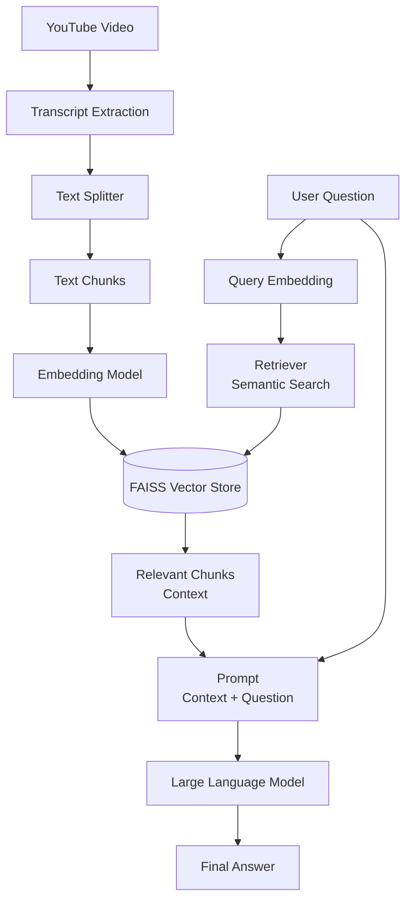

# 🎥 YouTube Chat System (RAG + Streamlit)

An AI-powered **YouTube Chat System** that enables users to **chat with YouTube videos** using **Retrieval-Augmented Generation (RAG)**.  
The system extracts video transcripts, builds a semantic search index, and generates accurate, context-aware responses through a **Streamlit-based interactive UI**.

---

## 🚀 Project Overview

Large Language Models cannot directly understand video content.  
This project solves that problem by transforming **YouTube video transcripts into searchable knowledge**, allowing users to ask natural language questions about video content.

The system combines:
- YouTube transcript extraction
- Vector-based semantic search
- Large Language Models
- Interactive Streamlit UI

---

## 🧠 System Architecture

## ⚙️ How It Works

The system first extracts transcripts from a YouTube video and converts them into raw text.
The text is split into smaller chunks to improve semantic understanding and efficiency.
Each chunk is converted into vector embeddings and stored in a FAISS vector database.

When a user asks a question through the Streamlit interface, the query is embedded using the same embedding model.
A semantic retriever searches the vector database to find the most relevant transcript chunks.
These chunks are combined with the user query to form a prompt, which is passed to a Large Language Model to generate an accurate and grounded response.

## 🖥️ Streamlit Interface

The Streamlit application provides:

Input for YouTube Video ID

Chat-style question input

Real-time AI-generated answers

Simple and intuitive user interface

## 🛠️ Tech Stack

Python

Streamlit

LangChain

OpenAI (LLM & Embeddings)

FAISS

YouTube Transcript API

python-dotenv

## 📦 Installation
git clone https://github.com/priyanshsingh11/youtube-chat.git
cd youtube-chat
python -m venv venv
venv\Scripts\activate
pip install -r requirements.txt

## 🔐 Environment Setup

Create a .env file in the project root:

OPENAI_API_KEY=your_openai_api_key_here

▶️ Run the Application
streamlit run main.py

## 📌 Use Cases

Chat with educational YouTube videos

Extract insights from long lectures or podcasts

Video-based knowledge assistants

AI-powered video Q&A systems

## ✨ Key Features

Interactive Streamlit UI

Semantic search over video transcripts

Reduced hallucinations using RAG

Scalable and modular architecture

## 👤 Author

Priyansh Singh
Machine Learning Engineer | AI & Backend Developer

GitHub: https://github.com/priyanshsingh11
