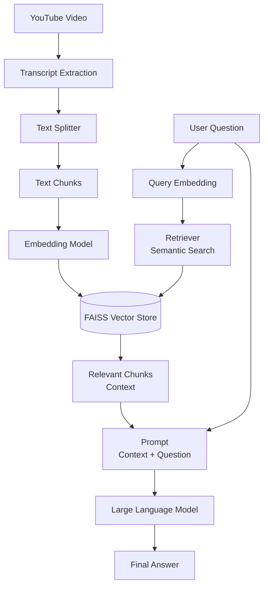

# 🎥 YouTube Chat System (RAG + Streamlit)

An AI-powered **YouTube Chat System** that enables users to **chat with YouTube videos** using **Retrieval-Augmented Generation (RAG)**.  
The system extracts video transcripts, builds a semantic search index, and generates accurate, context-aware responses through a **Streamlit-based interactive UI**.

---

## 🚀 Project Overview

Large Language Models cannot directly understand video content.  
This project solves that problem by transforming **YouTube video transcripts into searchable knowledge**, allowing users to ask natural language questions about video content.

The system combines:
- YouTube transcript extraction
- Vector-based semantic search
- Large Language Models
- Interactive Streamlit UI

---

## 🧠 System Architecture

